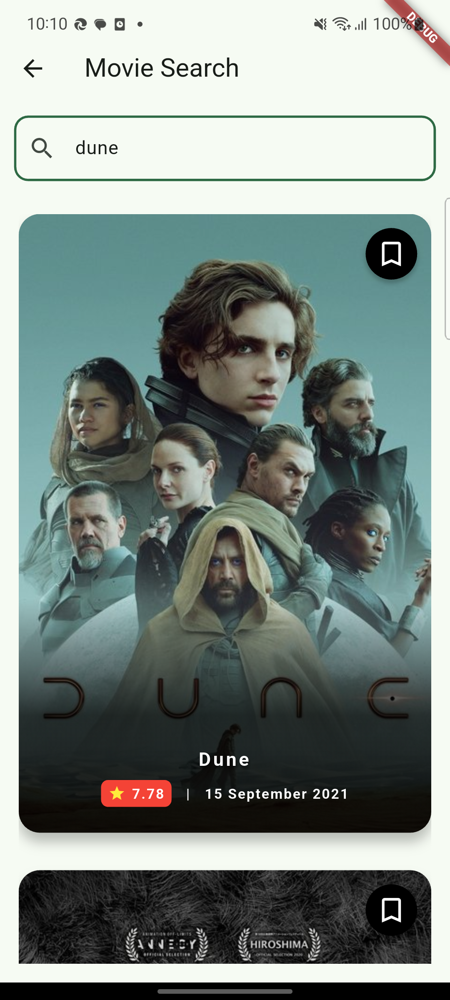
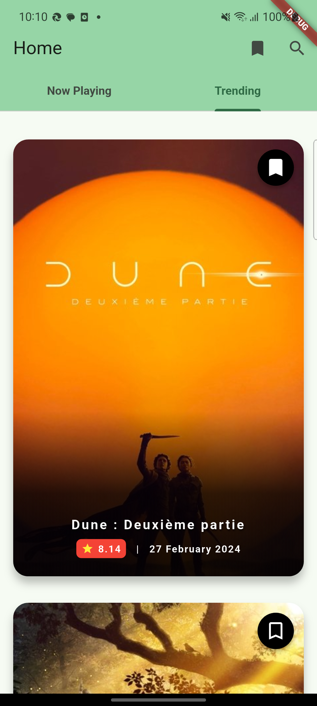
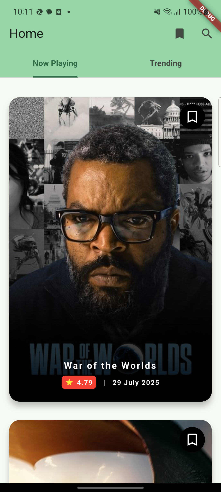
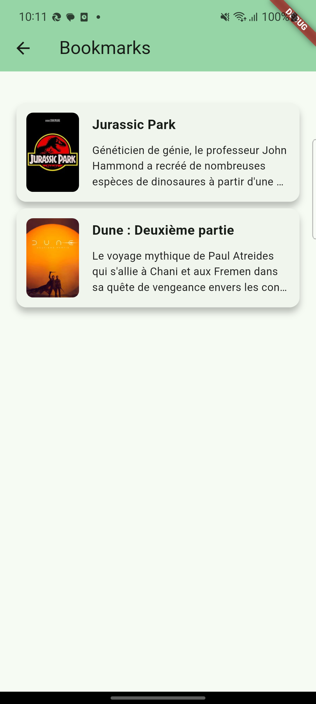
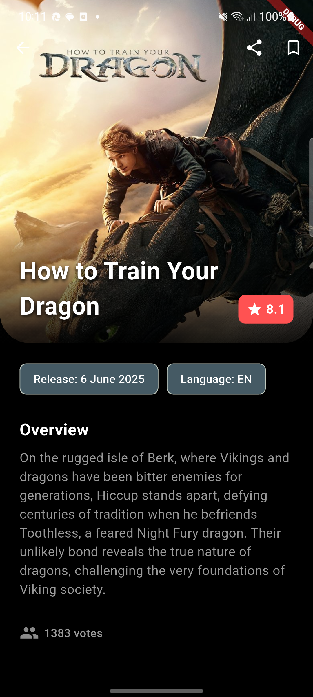

# flutter_application_1

A new Flutter project.

## Getting Started
# Inshorts Job task
Flutter assignment given by Educhamp.
It includes creation of a basic movie app using TMDB API.

1. Home Page with Playing now movies and Trending movies
2. Bookmarked movies
3. Search Movie Screen
4. Movie Detail Screen
5. Deeplink to Movie Detail Screen

App follows MVVM and repository pattern.

### Libs used
1. Retrofit for API calls
2. SQLite database for caching
3. Consumer/Provider for state management

### Components used from `react-navigation-tabs`. [Find Usage](./src/lib/router.js)
1. createMaterialTopTabNavigator used for Navigator with tabs at the top

### Run
1. Clone this repo 
2. flutter pub get
3. flutter pub run build_runner build --delete-conflicting-outputs
4. flutter run

Get API key [here](https://www.themoviedb.org/settings/api)
### Output

## Note :
 Due to time constraint, Session management is not handled. So kindly expect API call failures. Use retry buttons wherever possible.

 Also, API keys and tokens are hard coded for faster implementation. Recommended way is to store them in env file.

